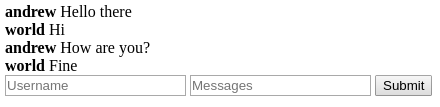
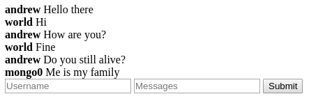

# Report

## First Iteration

Output of commands after the first iteration:

* [rs.status()](output/first_status.json)
* [rs.config()](output/first_config.json)

Screenshot of the application:

## Second Iteration

Output of commands after the second iteration:

* [rs.status()](output/second_status.json)
* [rs.config()](output/second_config.json)

Screenshot of the application:

